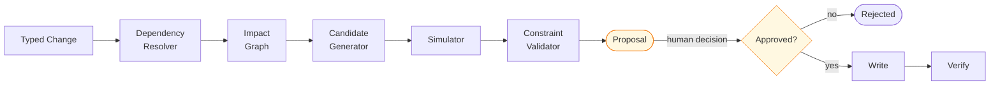

# Architecture

## 1. Technology Stack

### Frontend

- Angular
- TypeScript
- WebSocket client

### Backend

- Node.js
- Express
- TypeScript

### Database

- MongoDB

### AI / Model

- AWS Bedrock
- Provider-independent `ModelPort`
- Deterministic `FakeModelAdapter` for local testing

### Agent Integration

- Model Context Protocol (MCP)
- Explicit read / analyze / simulate / write tool contracts
- Human approval boundary for consequential writes

### Search

- AWS OpenSearch
- Optional for MVP
- Used for production document search/RAG, not dependency analysis

### Async Processing

- AWS SQS
- Dead Letter Queue
- Local deterministic queue adapter

### Realtime

- WebSocket

### Infrastructure

- AWS
- Terraform

### CI/CD

- GitLab CI

### Testing

- TypeScript strict mode
- Unit tests
- Integration tests
- MCP contract tests
- Playwright E2E
- Deterministic local mocks

### Local Development

- FakeModelAdapter
- In-memory/fake queue
- deterministic Demo Movie fixtures
- MongoDB local/test environment

## 2. Why This Stack

### Angular

Angular is intentionally used instead of the author's usual
React/Next.js stack to demonstrate the ability to work with the
frontend technology used by the target production SaaS environment.

### MongoDB

MongoDB is used as the operational data store to practice document
modeling and indexing for connected production-domain data.

### AWS Bedrock

Bedrock is used behind a provider abstraction so AI orchestration
remains independent of a specific model provider.

### SQS

Production change analysis and AI jobs can be asynchronous.
SQS provides retries, decoupling, and a production-ready queue model.

### MCP

MCP creates an explicit capability boundary between the AI agent and
the production application rather than allowing unrestricted database
or API access.

### Terraform

AWS resources are expressed as infrastructure as code so the system
can be reproduced, reviewed, and tested consistently.

### WebSocket

Realtime events expose long-running agent stages such as analysis,
simulation, approval, application, and verification.

### OpenSearch

OpenSearch is reserved for document retrieval and RAG.
It must not replace deterministic production dependency queries.

### Free-first constraint

This is an independent, self-funded portfolio project built by a single
developer. There is no budget for metered cloud services, so every
component that would bill per use has a free, zero-install adapter that is
the **runtime default**, while the target-stack adapter remains in the
codebase to demonstrate the intended production shape.

| Concern | Target adapter (portfolio) | Default adapter (free, runs anywhere)                         |
| ------- | -------------------------- | ------------------------------------------------------------- |
| Store   | MongoDB                    | JSON file store (`PCA_STORAGE=file`)                          |
| Model   | AWS Bedrock                | Rule-based interpreter, Ollama if present (`PCA_MODEL=rules`) |
| Queue   | AWS SQS                    | In-process queue                                              |
| Search  | OpenSearch                 | none (optional feature, excluded from MVP)                    |

Consequences:

- domain and application packages never see which adapter is active;
- the published npm package runs the full product on a clean machine with
  `npx` and no credentials;
- Bedrock, SQS, and Terraform `apply` are exercised only when a budget or
  AWS account exists (see `TASKS.md` items marked DEFERRED).

Decision record: `docs/decisions/0001-free-first-adapters.md`.

## 3. Goals

- Strongly typed, agent-friendly codebase
- Explicit domain boundaries
- Deterministic change analysis
- Safe MCP capability boundary
- Cloud-portable local development
- Fast automated feedback
- Architecture that exercises Angular, Node/Express, MongoDB, AWS concepts, Terraform, GitLab CI, WebSocket, and MCP

## 4. High-level architecture

```mermaid
flowchart TB
    UI["Angular Web App"] -- "REST / WebSocket" --> API["Express API<br/>(delivery adapter)"]

    API --> DOMAIN["Change Analysis Domain<br/>deterministic rules"]
    API --> REPO["Repository port"]
    API --> QUEUE["Job/Queue port"]
    API --> AGENT["Agent Orchestrator<br/>(runChangeAgent)"]

    REPO -.-> REPOIMPL["file store (default) / memory store /<br/>Mongo store (deferred, §9)"]
    QUEUE -.-> QUEUEIMPL["in-process queue (default) /<br/>SQS (deferred, §10)"]

    AGENT --> MODEL["Model port"]
    MODEL -.-> MODELIMPL["rule-based adapter (default) /<br/>Ollama / Bedrock (deferred, §7)"]
    AGENT --> MCPCLIENT["MCP Client"]

    MCPCLIENT --> MCPSERVER["MCP Server"]
    MCPSERVER --> TOOLS["allow-listed tools<br/>(read / analyze / simulate / propose / write / verify)"]
    TOOLS --> APPSVC["Application services<br/>(same use cases the API calls)"]
    APPSVC --> REPO

    classDef free fill:#e8f5e9,stroke:#2e7d32,color:#1b1b1b;
    class REPOIMPL,QUEUEIMPL,MODELIMPL free;
```



Important: MCP write tools call application services, the same ones the REST
API calls (§6 "REST API"). They do not bypass domain rules by writing
directly to the store. Dashed boxes name every adapter each port can select;
the free, no-account default is always listed first, and the paid/deferred
options (a live Mongo replica set, SQS, Bedrock) are documented but never
required to run the product (§2 "Free-first constraint").

## 5. Suggested repository

```text
product_agent/
├── apps/
│   ├── web/                 # Angular
│   ├── api/                 # Express API
│   └── mcp-server/          # MCP transport/tool registration
├── packages/
│   ├── domain/              # entities, invariants, change engine
│   ├── application/         # use cases, and the ports they depend on
│   ├── contracts/           # zod/types shared across boundaries
│   ├── bootstrap/           # composition root: selects adapters from env
│   ├── adapters/
│   │   ├── file-store/      # JSON file repositories (default)
│   │   ├── memory-store/    # in-memory repositories
│   │   ├── memory-queue/    # in-process queue (free default)
│   │   ├── ws-gateway/      # WebSocket notifications (ws)
│   │   └── mongo-store/     # MongoDB repositories (TASK-102)
│   ├── realtime-client/     # reconnecting client (browser or Node)
│   ├── fixtures/            # deterministic Demo Movie
│   └── test-support/        # fakes, builders, shared contract suites
├── infra/
│   └── terraform/
├── docs/
├── CLAUDE.md
├── SPEC.md
├── DOMAIN.md
├── DESIGN.md
├── ARCHITECTURE.md
├── MCP.md
├── TESTING.md
├── TASKS.md
└── WORKFLOW.md
```

A monorepo is recommended so shared contracts and verification can be run from one root.

## 6. Layering

### Domain

Pure TypeScript. No Express, Angular, MongoDB, AWS SDK, MCP SDK, or model SDK imports.

Owns:

- entities/value objects;
- invariants;
- dependency graph;
- impact analysis;
- proposal validation;
- schedule compatibility rules used by MVP.

### Where entity shapes live

`packages/contracts` owns the schemas and is the single source of truth for
entity shape. The domain consumes the inferred types rather than restating them,
so a field cannot mean one thing in Mongo, another in an MCP response, and a
third in the UI.

This does not weaken the domain boundary. A schema library is not a framework:
the domain still imports no HTTP server, database driver, cloud SDK, MCP
transport, or model SDK, and the ESLint boundary rule enforces that.

### Application

Coordinates use cases:

- submit change;
- resolve entities;
- analyze impact;
- simulate proposal;
- approve/reject;
- apply proposal;
- verify proposal.

Depends on interfaces/ports, not concrete infrastructure.

### Adapters

Concrete implementations:

- Mongo repositories;
- Bedrock model;
- fake deterministic model;
- SQS;
- in-memory queue;
- OpenSearch;
- WebSocket event publisher.

### Delivery

- Express HTTP routes
- WebSocket gateway
- MCP server
- Angular UI

### REST API

`apps/api` (TASK-110) is an adapter like the MCP server. Routes under
`/api/productions/:productionId` parse HTTP, hand the application a typed
input and a call context, and render the result. Reads, analysis, proposal,
apply, and verify routes run the same tool handlers as MCP
(`@pca/mcp-server/handlers`), so a route and a tool validate the same input,
run the same use case, and validate the same output; a route cannot expose a
capability the tool surface lacks. Two things are REST-only because a human
does them: recording a decision on a proposal, and submitting a change as a
job whose progress the UI follows (`POST .../changes`, resumable at
`resolving` with the chosen change). Apply runs synchronously, or as a job
continuing a run's timeline when `jobId` is given. Errors are the same
`ToolError` as everywhere, with the HTTP status derived from the code and
never chosen per route. Identity is verified, never declared (TASK-914):
every route but `/health` and `/auth/demo-session` requires
`Authorization: Bearer <token>`, the token is verified through the
application's `IdentityPort`, and the acting identity — what `approvedBy`,
`createdBy`, and every audit `actorId` record — is the verified principal's
subject. No header names the actor; a caller-supplied `X-Actor-Id` is
ignored. Authorization is server-side and twofold, checked before any
handler runs: the production must be on the server's allow-list *and* in the
principal's grant, and the method's role must be held (`viewer` for reads,
`requester` for writes); the decision route's `approver` requirement, and
maker-checker (the change's submitter may not decide its proposal), live in
`decideProposal` itself, so no delivery adapter can skip them. A missing or
bad token is `UNAUTHENTICATED` (401); a role or grant the token lacks is
`TOOL_UNAUTHORIZED` (403). `X-Correlation-Id` is honoured and always echoed,
validated against the contract the persisted records enforce (TASK-906): one
that would not fit a change request is replaced with a fresh ID and the
request proceeds. `PCA_ACTOR_ID` (the MCP server's own identity) is held to
the same rule at startup. The WebSocket gateway is attached to the same HTTP
server on `/ws`; its upgrade is authenticated the same way (the token from
`Authorization`, or `?access_token=` for browsers, which cannot set headers
on a socket) and refused with 401 before any socket exists. Before the
token, the browser's Origin (TASK-916): only the API's own host or an origin
listed exactly in `PCA_ALLOWED_ORIGINS` (the Angular dev server's origins by
default in demo mode) may open the socket, and a query-string token without
an Origin is refused as well, so a hostile page cannot drive a developer's
loopback API even with a token in hand; refusals are 403, again before
`handleUpgrade`. Work is bounded (TASK-917): every request is charged to
the client address (`PCA_RATE_LIMIT_PER_MINUTE`) before anything else runs,
writes under a production to the verified principal
(`PCA_WRITE_LIMIT_PER_MINUTE`), both answered 429 with `Retry-After` from an
in-process fixed window; request and header timeouts drop a stalled
connection; the JSON body stays at 256 KiB; and every externally supplied
array has a documented maximum (`INPUT_LIMITS`, MCP.md §3), so a body cannot
carry thousands of scene IDs into analysis. Every answer carries the API's
security headers (TASK-928, `securityHeaders`, first middleware, so errors
and 404s get them too): a `default-src 'none'` CSP with `frame-ancestors
'none'`, `nosniff`, `X-Frame-Options: DENY`, `Referrer-Policy:
no-referrer`, same-origin `Cross-Origin-Resource-Policy`/`-Opener-Policy`,
and `Cache-Control: no-store` — an answer is a production's current state
or a person's session and is never cached anywhere — plus HSTS only when
`PCA_TLS_TERMINATED=true`, since HSTS over plain HTTP is ignored at best.
The console's own policy lives where the console is served: the dev
server's `headers` in `angular.json` (`script-src 'self'`, `style-src
'self' 'unsafe-inline'` because Angular injects component styles as style
elements, `connect-src 'self'` for `/api` and `/ws`, `frame-ancestors
'none'`), which the E2E suite loads the UI under; a deployment's static
host or proxy applies the same four headers. A job named by a decision, an
apply, or a resumed change is bound to what it claims (TASK-919,
`describeJobMismatch`): it must be the analysis that produced that exact
proposal, at a stage where the action makes sense (`JOB_MISMATCH`, 409,
otherwise, before either the job or the proposal is touched), a resumed
change must come from the principal who started the job (`requestedBy`, now
on every run), and the move itself carries the same expectation into the
atomic update (`AdvanceOptions.expect`), so it is a compare-and-set; a
queue handler whose payload names another proposal fails the queue job and
leaves the run alone.

### Angular UI

`apps/web` (TASK-501) is Angular 21, zoneless, signals, standalone
components. The shell is DESIGN.md §2: a header with the production name,
the connection status as a word, the version, and jobs in progress; the
production nav; and a routed area holding the change workspace or a view of
the production. Two services are the UI's only connection points:
`ProductionApi`, a thin REST client typed by the shared contracts whose
errors carry the server's `ToolError`, and `RealtimeService`, which wraps
`@pca/realtime-client` in signals and recovers over REST. `ProductionStore`
owns the open production and its version, which the header shows so a
coordinator can tell the plan they are reading is the plan the server has.
The dev server proxies `/api` and `/ws` to the API. The app type-checks
itself with the DOM lib (the root TypeScript project excludes it) and is
built with AOT and strict templates in the verify gate; its specs run with
vitest and jsdom through `ng test`. Serving it (`ng serve`, TASK-604's E2E
`webServer`) needed one fix: the dev server's Vite-based dependency
pre-bundler resolves `@pca/contracts`/`@pca/realtime-client` as if they were
ordinary `node_modules` packages, using a plain esbuild scan that does not
resolve their extensionless relative imports (`export * from "./entities"`)
the way the rest of the toolchain (`tsc`, vitest, the `ng build`/`ng test`
builders) does — so `angular.json`'s `serve` options set `prebundle: false`.
The two packages are still bundled into the app, just without that
pre-scan; `ng build`/`ng test` were never affected, since prebundling is a
dev-server-only step.

The change workspace (TASK-502) adds a component-scoped
`ChangeSubmissionService`, one instance per workspace, provided by
`ChangeWorkspace` and shared by its `ChangeInput` and `AmbiguityResolution`
children through DI. It follows §11's rule literally: a live event for the
job it is tracking is read only as a hint to re-read that job over REST,
never as the update itself, which is what lets a field the socket event
cannot carry (the interpretation `options` a `resolving` run holds) reach
the UI correctly regardless of timing. Because the Angular router can reuse
the workspace component instance across productions, `ChangeWorkspace`
resets the service whenever the open production changes.

The impact panel (TASK-503) follows the same shape once more: the DESIGN.md
§3 explanation is application logic (`analyzeChangeImpact`'s `explanation`
field, via `describeImpact`), a REST-only route
(`POST .../analysis/explanation`) exposes it because the MCP tool contract
has no room for it, `ChangeSubmissionService` fetches it once the tracked
job's change request is known, and `ImpactPanel` renders it with no logic of
its own — every line of text is the server's.

The proposal card and candidate comparison (TASK-504) take a third path:
`runChangeAgent` already builds `describeProposal`'s structured card, and
already ranks/rejects shoot days for a scheduling change, once, synchronously,
at proposal-creation time. Recomputing either later would mean re-simulating
against whatever the production has become since, which is not the world the
approved proposal describes. So the ANALYZE_CHANGE job handler carries both
onto the tracked `JobRun` the same way `options` carries ambiguity (TASK-502,
TASK-403): no REST route, no `ChangeSubmissionService` fetch — they arrive
with the job the service already reads. `ProposalCard` and
`CandidateComparisonPanel` render them, again with no logic of their own.

The approval flow (TASK-505) is `ChangeSubmissionService`'s last two
methods: `reject` and `approveAndApply`, both gated in the UI to a job at
`awaiting_approval` and both still fully re-checked by the backend (DESIGN.md
§5, "the backend, not the UI, enforces approval validity"). `reject` posts
the decision with the job's ID, which the decision route uses to complete
that job server-side (`awaiting_approval → completed`, the edge
`JOB_STAGE_TRANSITIONS` already named but nothing exercised before this
task) — best-effort and idempotent, since the decision itself is what
matters and a repeat rejection finds the job already terminal.
`approveAndApply` decides `APPROVE`, then applies as a job continuing the
same run's timeline using `expectedProductionVersion` from the decision's
own response (the version the proposal was actually built against) rather
than reading the production's current version and hoping nothing moved. The
UI's own gate before that call — `ApprovalConfirmation` — is what DESIGN.md
§5 asks for: a summary, the operation count, warnings, the current version,
and the fixed notice that approving changes the plan.

The progress timeline (TASK-506) replaces the workspace's earlier raw
job-list panel with DESIGN.md §6's ✓/●/○ list, derived by a pure function,
`buildJobProgress`, from the tracked job's `history` — no fetch, no state of
its own, same as `describeImpact`/`describeProposal` on the server side.
`JobProgressTimeline` renders its result with no logic of its own. It reads
`ChangeSubmissionService.job`, the same tracked job every other panel reads,
not `ProductionStore.openJobs` (which still exists, for the header's open-job
count) — the timeline is always about the one change this workspace is
following, not every job the production happens to have open.

The Schedule and Audit nav views (TASK-507, TASK-508) needed no new backend
surface at all — `get_schedule`/`get_scene` and the `/audit` route (TASK-110)
already existed — so both are pure Angular polish on views the shell
(TASK-501) had left as placeholders. `SchedulePage` resolves every scene ID
a shoot day names through `get_scene` (a scene ID is opaque, never assumed
to encode anything) and lays out `buildScheduleRows`'s result, one shoot day
per section; "before/after" is simply always showing the schedule the server
currently has, so approving a change and returning here is the comparison.
`AuditPage` turns each `AuditEvent` into one DESIGN.md §7 sentence via
`describeAuditEvent`, reading only its `action` and structured `metadata` —
never a model's own words — and reverses the audit repository's newest-first
order (TESTING.md: "that is what an operator asks for") because this view's
job is the story in the order it happened, not a log.

## 7. AI architecture

Use a provider interface:

```ts
interface ModelPort {
  interpretChange(input: InterpretChangeInput): Promise<InterpretedChange>;
  explainImpact(input: ExplainImpactInput): Promise<string>;
  rankCandidates(input: RankCandidatesInput): Promise<RankedCandidate[]>;
}
```

Production target: Bedrock adapter.

A model call can be stopped (TASK-929, SEC-014 / AUD-023): every
`ModelPort` method takes `{ signal }`, and `guardModelPort` hands each
provider call its own `AbortSignal`, aborted when the per-call budget runs
out or when the caller's own signal (threaded through `runChangeAgent` and
`interpretChange` inputs) is aborted — the same event that rejects the
call, so the caller stops waiting and a cancellable provider (an HTTP
client, a streaming SDK) stops spending sockets and paid tokens; a caller
that gives up sees `ABORTED`, a budget that runs out `TIMEOUT`. The guard
also bounds calls in flight at the provider (`maxConcurrent`, default 4),
queueing the rest with the budget starting only when a call actually
starts, so a burst of analyses cannot fan out into unbounded provider
concurrency. The rule-based adapter needs no cancellation; the fake
model's hang mode honours the signal, which is how the guard's abort is
proved to reach an adapter.

Model prose is untrusted presentation data (TASK-920, SEC-009 / AUD-014).
The contracts already keep a narrative or a ranking reason from adding an
operation or an effect; `guardModelPort` now also keeps it from lying to
the approver, with two closed checks. A text may not assert authorization
or safety at all — "already approved", "approved by …", "no approval
needed", "without approval", "safe to apply", "no risk" — because those are
the engine's and the approver's to say. And it may not contradict the
findings it was handed ("no conflicts" against a conflict, "no impact"
against an impact, "no warnings" against a warning) or name an ID-shaped
token (`CAST-BOB`, `SD-2026-09-29`) that was not among the change, the
impacts, the conflicts, or the candidates it was shown. A rejected text is
`UNGROUNDED_OUTPUT`, logged as `model_output_rejected`, and the
orchestrator's fallback shows the deterministic card with no prose rather
than with a false paragraph. In the UI the narrative is rendered last,
under a "Model narrative" label with a caveat that the effects and
operations above it are the facts; the approval confirmation shows only
deterministic fields (headline, operation count, warnings, version).  
Tests/local deterministic mode: fake adapter.

Do not couple domain types to a Bedrock response shape.

Structured AI output must be schema-validated before use.

The port's three operations are the only things a model is asked. Their
input and output shapes are contracts in `packages/contracts` (`model.ts`),
and `guardModelPort` in the application layer wraps any adapter so that every
answer is schema-validated and grounded before anything downstream sees it:

- an interpretation may name only IDs that were in the context it was given,
  so a confident answer about a made-up entity is refused as
  `UNGROUNDED_OUTPUT` rather than reaching intake;
- a ranking must be a permutation of the candidates it was given, with ranks
  1..n and a reason each; nothing added, nothing dropped;
- a malformed answer, a provider exception, and a missed time budget become
  `ModelError`s with a stable code and no prompt text.

Adapters therefore stay simple. The rule-based adapter, a local Ollama, and
Bedrock all sit behind the same guard, and the guarantee is tested once.

The rule-based adapter reads intent, not just keywords (TASK-908, post-review
remediation in TASKS.md): its unavailability pattern matches negative forms
only, and a sentence that says someone is *available* is refused as
UNSUPPORTED with a reason — there is no "available again" change type, and
"is available" must never be recorded as its opposite. Date ranges ("2026-09-18
to 2026-09-22", "September 18–22", "Friday through Monday") are parsed before
single dates and kept whole, with both ends validated and an end before its
start refused, where the first day alone used to be taken and the rest of the
constraint silently dropped.

## 8. Change engine

The change engine is deterministic.



Everything left of the diamond is a read or a record; no production state
changes until a human decides. This is CLAUDE.md's non-negotiable rule 8,
`READ → ANALYZE → SIMULATE → VALIDATE → PROPOSE → APPROVE → WRITE → VERIFY`,
with the boxes above covering `ANALYZE` through `PROPOSE`.

The first MVP candidate generator can be simple and explicit rather than “smart”:

- find another shoot day where required cast/location are available;
- preserve scene requirements;
- return a small ordered set of valid candidates.

Optimization/constraint-solving can be added later.

`runChangeAgent` in the application layer is the loop: interpret, intake,
analyze, candidates, rank, simulate, explain, propose. Every step before
"propose" is a read or a record, and the proposal is a persisted plan awaiting
a human; no production state changes on any path. The model is asked three
things only: to read the sentence, to order candidates the engine already
validated, and to put findings into prose. The plan's shape is deterministic
code: the recorded fact first, then the remedy to the top-ranked day, then a
stale mark for every touched call sheet. When the model cannot rank or explain,
the agent falls back to date order and a data-only summary rather than
stopping.

Candidates for a cast or location unavailability are generated against a
preview of the production with the reported fact already applied, not
against the stored state (TASK-904, post-review remediation in TASKS.md): a
multi-day unavailability would otherwise offer a day inside its own range,
which simulation then refuses as INVALID although a different day — or an
honest NO_CANDIDATE — was there to be had. The generator's own availability
check refuses those days with the real reason, one step before simulation
would. The MCP tool `generate_schedule_candidates` still answers against the
stored state, as a read must; a caller that knows about a pending fact passes
`excludeDates`.

The explanation layer (`explanation.ts` in the application package, TASK-306)
is what makes the data-only summary possible: `describeProposal` builds the
DESIGN.md §4 card (headline, `+`/`!` effects, operation lines) from the
snapshot, the operations, and the simulation findings, and `describeImpact`
builds the DESIGN.md §3 panel from an impact report. Both are pure functions
with contracts in `packages/contracts` (`explanation.ts`). The model's prose
is attached as an optional `narrative`; the rendered card is the proposal's
`summary`.

## 9. MongoDB

MongoDB stores operational state and audit records.

Recommended collections:

- productions
- scenes
- castMembers
- locations
- requirements
- shootDays
- callSheets
- tasks
- changeRequests
- proposals
- approvals
- auditEvents

Use indexes for common dependency queries, e.g.:

- `scenes.productionId`
- `scenes.requiredCastIds`
- `scenes.locationId`
- `shootDays.productionId + date`
- `proposals.productionId + status`
- `auditEvents.productionId + createdAt`

Do not over-denormalize initially. Prefer clear ownership and queryability for the prototype.

### Storage adapters

The application depends on repository ports, never on a driver. Three adapters
implement them:

| Adapter | Package | Role |
|---|---|---|
| JSON file | `@pca/file-store` | Runtime default. No server, no native module, no account. |
| In-memory | `@pca/memory-store` | Unit tests and throwaway demo runs. |
| MongoDB | `@pca/mongo-store` | The portfolio target. Requires a replica set so commits are transactional; refuses a standalone server. |

Every store is wrapped by `guardRepositories` in bootstrap (TASK-602): a
thrown driver error becomes an `InfrastructureError` that names the boundary
as `<adapter>.<repository>.<method>` and keeps the cause. Use cases let it
propagate; the queue retries it and records the boundary and correlation ID
as the reason; the MCP server reports `INTERNAL_ERROR` naming the boundary
without the driver's message.

One contract test suite in `@pca/test-support` runs unchanged against each of
them. An adapter that merely compiles against the ports has proved nothing;
when two adapters disagree, the disagreement must fail in that suite rather
than inside a use case that assumed one of them.

The file store admits one writer at a time, whoever it is (TASK-903): every
mutation holds an `O_EXCL` lock file (`data.json.lock`) beside the data file
for its whole read-check-write, so a second instance in the same process, a
`seed` run beside the API, or a second server on the same path serialise
instead of each renaming its own version N+1 over the other's. A lock whose
owner pid is dead is reclaimed; one held by a live process is waited for, up
to a bounded timeout that surfaces as `STORE_LOCKED` rather than a silent lost
update. This is a correctness guarantee, not a throughput one — a busy
multi-writer deployment still selects MongoDB. Reads take no lock: rename is
atomic, so a reader sees a whole database, before or after, never a torn one,
and a second instance sees the first one's writes because every read goes
through to the file rather than a cache.

Mongo validates what it reads and writes (TASK-926, SEC-015 / AUD-020):
production state was already parsed with `productionStateSchema`; now
every change request, proposal, approval, audit event, idempotency row, and
job run is parsed with its strict contract schema on read (`parseRow`,
`packages/adapters/mongo-store/src/rows.ts`) and validated on write
(`validated`), inside the transactions too. A malformed row surfaces as
`STORE_CORRUPT` naming the collection, the row ID, and the path — never a
value — and a record the contract would refuse is `STORE_INVALID_WRITE`
with nothing written, the same two errors the file store raises. The
persisted idempotency row has one schema for both stores,
`storedIdempotencyRecordSchema` in `@pca/contracts`.

The data file is owner-only (TASK-921, SEC-010 / AUD-017): it holds cast
and location schedules, human-entered change text, identities, approvals,
and the audit trail, so the store creates its directory `0700` and its
data, temporary, and lock files `0600` at creation (never fixed up after a
readable window), refuses a data file, lock file, or directory entry that
is a symbolic link (`STORE_UNSAFE_PATH`), tightens an existing loose data
file to `0600` with a warning — or refuses it (`STORE_UNSAFE_PERMISSIONS`)
under `PCA_DATA_FILE_PERMISSIONS=refuse` — and warns about a loose directory
it did not create without ever chmodding it (`/tmp` is not ours to change).
`FileStore.verify()` runs once per instance before the first read or write,
and the composition root calls it at startup so a refusal fails startup
rather than the first request. Windows has no mode bits; the checks are a
no-op there. This is a single-user store: no encryption at rest, no
per-field access.

The same `fileDatabaseSchema` that validates every read validates every write
(TASK-906): the complete next database is parsed before the temporary file is
written, so a record the schema would refuse — a 129-character correlation ID
was the reproduction — is refused as `STORE_INVALID_WRITE` naming the field,
and the previous database stays exactly as it was. Before this, such a record
was written successfully and every later read failed with `STORE_CORRUPT`
until someone repaired the file by hand; a restart did not recover it.

Entity rows in Mongo use a composite `_id` of `productionId::id`, so an entity
ID that repeats across productions is two rows rather than a collision, and
every read still filters by `productionId`. Because entity IDs may themselves
contain colons, each part is escaped before the separator is applied
(`scopedRecordKey` in `@pca/application`, TASK-907): `%` first, then `:` as
`%3A`, so `(A, B::P)` and `(A::B, P)` are two keys and an escape cannot be
forged. `%` is outside the entity-ID alphabet, so an ID without a colon encodes
to exactly the string rows were always written with — no migration. The memory
store's maps use the same encoding; the file store, whose workflow arrays hold
every production's records, compares `productionId` and `id` together instead
of `id` alone. Audit rows keep Mongo's own
ObjectId, which increases with insertion order, so "newest first" stays correct
when two events share a timestamp.

Which adapter runs is decided in the composition root, `packages/bootstrap`,
from `PCA_STORAGE` (`file`, `memory`, or `mongo`) and its companions
(`PCA_DATA_FILE`, `PCA_MONGO_URI`, `PCA_MONGO_DB`). It is the one package that
depends on every adapter; the MCP server and the API ask it for a
`RepositorySet` and never name a driver.

The seed/reset command (TASK-801, `pnpm run seed`) is the one exception to
"never name a driver": `FileStore.resetProduction` clears every change
request, proposal, approval, audit event, and idempotency record belonging
to a production alongside replacing its state — `productions.save` alone
(the ordinary seed/reset path every adapter has) never touches those, so a
demo "restored" while still carrying a previous run's stale proposals and
audit trail would not be restored, just contaminated. No other adapter
needs this: the memory store is thrown away with the process, and Mongo is
the portfolio target, not the free runtime default this command exists
for. `resetDemoMovie` (`@pca/bootstrap`) wires `FileStore.resetProduction`
to the environment and refuses for any other `PCA_STORAGE`; `scripts/seed.ts`
is the one-command entry point, and the function it calls is what TASK-806's
future `seed` CLI subcommand will call too.

`RepositorySet.applyProposalTransaction` (TASK-901, post-review remediation
in TASKS.md) is the one atomic write behind `apply_approved_proposal`: the
version-checked mutation, the idempotency record, the proposal's `APPLIED`
status, and the audit event commit as a single unit in every adapter — one
Mongo transaction, one file-store `#mutate` cycle, one memory-store pass with
no `await` between the four writes — rather than four sequential calls a
partial failure could pull apart.

`RepositorySet.recordProposalDecision` (TASK-902) is the same shape for the
human decision: the approval, the proposal's decided status, and the audit
event commit together, and only if no decision exists for that proposal yet
— the compare-and-set that makes "a decision is final" true under
concurrency, not just in a single caller's read-then-write. In Mongo the
guarantee is the database's own: a unique `(productionId, proposalId)` index
on `approvals`, so a racing insert fails with a duplicate key and its
transaction aborts; the loser is answered with the record that won
(`ALREADY_DECIDED`), never with a second success.

## 10. Queue/SQS

Use asynchronous jobs for operations that may involve model calls or larger analysis.

Example envelope:

```ts
type JobEnvelope = {
  id: string;
  type: "ANALYZE_CHANGE" | "APPLY_PROPOSAL" | "VERIFY_PROPOSAL";
  productionId: string;
  correlationId: string;
  attempt: number;
  payload: unknown;
};
```

Requirements:

- idempotency key;
- bounded retry;
- explicit failure state;
- dead-letter strategy in AWS;
- local in-memory/fake queue with identical application contract.

Implementation (TASK-401): `QueuePort` in the application layer fixes the
contract. An idempotency key names a job once (a repeat enqueue is a
`DUPLICATE`); retry is bounded by `QueuePolicy.maxAttempts` and exhausting it
is an explicit `FAILED` state plus a dead-letter entry; a handler answers
`COMPLETED`, `RETRY`, or `FAILED`, and an exception it throws is retried as
transient; every state change is observable through `onTransition`, which is
what the job state machine and the WebSocket gateway consume. Timers go
through a `Scheduler` port so tests can hold time still. `@pca/memory-queue`
is the free default (`PCA_QUEUE=memory`), single-process, delivering one job
at a time in enqueue order; `drain()` is its deterministic path and
`start()`/`stop()` its background one. The SQS adapter (TASK-402) is deferred
and would run the same contract suite.

Job runs and restarts (TASK-923, AUD-009): with `PCA_STORAGE=mongo` the
job runs live in a `jobRuns` collection (`MongoStore.jobRuns`), so a
restart keeps every "where is my change?" answer; `update` is a genuine
compare-and-set on a row revision with a bounded retry, so two writers
both land and neither overwrites the other, the same guarantee the
in-memory store gives synchronously (one shared contract,
`describeJobRunContract`, proves both). With the file or memory store,
runs stay in memory as before. The in-process queue's jobs are never
durable — a durable queue is the deferred SQS adapter — so at startup
`reconcileInterruptedRuns` fails every unfinished run a worker owned
(`received`, `analyzing`, `simulating`, `validating`, `applying`,
`verifying`) with a reason that says the server restarted and what to do
(`applying` gets a sharper one: the idempotent apply may have committed,
check the proposal first), and keeps the runs waiting on a human
(`resolving`, `awaiting_approval`), which the next request continues.

What a run says when infrastructure fails (TASK-924, AUD-011): a thrown
error is an infrastructure fault by convention, and its text — a driver's
message, a host, a file path, the boundary that failed — belongs in the
operator's log, not in a job run a coordinator reads. The queue therefore
carries two texts on a transition: `reason`, the raw
`describeFailure` line for operators (also the record's `lastError`), and
`userReason`, `describeFailureForUser`'s one fixed sentence plus the
correlation ID. `bindQueueToJobTracker` writes `userReason` into the run
and logs `reason` once as `job_infrastructure_failure` with the job,
queue-job, production, and correlation IDs. A handler's own verdict (a
`FAILED` outcome, a use-case error) is domain text and reaches the run as
it is — "Proposal P-1 is invalid: …" is for the coordinator; "socket hang
up" is not.

## 11. Realtime/WebSocket

WebSocket publishes job state and user-visible events.

Do not make WebSocket the source of truth. The client can reconnect and fetch canonical job/proposal state via REST.

Implementation (TASK-403): the job stage machine in `packages/application/src/jobs/`
is pure. `JOB_STAGE_TRANSITIONS` is the only way a run moves, and it has no
edge into `applying` except from `awaiting_approval` and no edge out of
`completed` or `failed`; a disallowed move throws `JobStageError`. A `JobRun`
(`jobRunSchema`) is the canonical record: current stage, its status, a
message, the linked change request and proposal, and every event ever
published for it. `JobTracker` applies the machine, persists the run through
the `JobRunRepository` port, and publishes `AgentJobEvent`s, so an event
exists only if the record also holds it. Each move publishes the stage left
as `COMPLETED` (or `FAILED`) and the stage entered as `STARTED`.

Queue handlers drive the machine. The analyze handler walks `received →
resolving → analyzing → simulating → validating → awaiting_approval`, using
`runChangeAgent`'s `progress` hook; an ambiguous sentence leaves the run at
`resolving` with the question as its message until a resolved change arrives;
nothing to propose completes from `analyzing`; an invalid proposal fails at
`validating`. The apply handler walks `awaiting_approval → applying →
verifying → completed` and reads the run's stage before acting, so a job
redelivered after a crash mid-verification verifies without applying again.
A use-case error fails the run and the queue job (no retry); an exception
propagates and the queue retries. `bindQueueToJobTracker` announces retries on
the current stage and fails the run when the queue gives up.

Two properties make that retry actually recoverable (TASK-905, post-review
remediation in TASKS.md). Every tracker move is one atomic
`JobRunRepository.update` — the stage machine runs against the run as it is
at the instant of writing, never against a copy loaded earlier — so the
binder's retry note and the handler's next `advance` cannot overwrite each
other, and only what landed is published. And a redelivered analyze job,
which re-runs its orchestration from the top, treats progress callbacks as
monotonic: a stage the run has already reached or passed is left alone
(`isAtOrBeyond`) rather than moved back to, which the graph rightly refuses
and which used to fail every retry at `simulating` or `validating`. The
change request the first attempt recorded is attached to the run on the
first progress callback and handed back to `runChangeAgent` on the retry, so
the sentence is not re-interpreted and no duplicate request is submitted; the
analysis audit lines do repeat, honestly, because analysis did run again.

The gateway (TASK-404, `@pca/ws-gateway`, built on `ws`) is a notification
channel only. The application publishes `RealtimeNotification`s to an
in-process `NotificationHub`: job events are forwarded from the tracker
(`forwardJobEvents`), and proposal status comes from
`withProposalNotifications`, a decorator on the repository set that
publishes after every successful proposal status write — `proposals.save`,
and the two atomic writes that carry a status with them,
`recordProposalDecision` and `applyProposalTransaction` (TASK-901/902); a
write that did not land notifies nothing. The gateway subscribes to the hub and forwards each
notification to the connections that subscribed to that production. It
holds no history and replays nothing; its first message on every connection
(`welcome`) names REST as the canonical source, and a reconnecting client
re-reads job runs and proposals (TASK-405). Clients name productions
explicitly; an `authorize` hook can refuse one, subscriptions per connection
are capped, malformed messages get an `error` reply rather than a
disconnect, and a heartbeat drops sockets that stop answering. The gateway
attaches to the API's HTTP server on a path or listens on its own.

Recovery (TASK-405) is a read plus an ordering rule. The read is
`createGetRecoverySnapshot`: the production version, every job run (newest
first), and every proposal still open (`DRAFT`, `AWAITING_APPROVAL`,
`APPROVED`); `createGetJobRun` reads one run, visible only through its own
production. The REST API serves both (TASK-110). The ordering rule lives in
`@pca/realtime-client`, which runs unchanged in a browser or under Node: on
every connection, first or re-established, it subscribes to each production
it follows, waits for the server's `subscribed` acknowledgement, and only
then reads the snapshot. Anything that happens after the acknowledgement
arrives live; the snapshot, read after it, covers everything before, so no
event can fall between them. Live notifications are merged into the
recovered records; one that arrives while a recovery is in flight is held
and applied after the snapshot; one about a job or proposal the client does
not know triggers another recovery rather than a guess; one the record
already reflects is ignored. Reconnection backs off exponentially through an
injected timer, and a socket that closes mid-recovery discards what it held,
because the next recovery is the truth.

Two refinements from the post-review remediation (TASK-910, code review #11
and #12). `openProposals` means what it says: a live notification that takes
a known proposal to `APPLIED`, `REJECTED`, or `FAILED` removes it from the
list rather than leaving a closed record in an array the UI reads as "still
to act on", and `APPLIED` additionally triggers a recovery, because that
write advanced the production version (INV-7) and the notification does not
carry the new number — the record does, so the header shows the committed
version without waiting for a reconnect. And a recovery read that fails is
retried, not abandoned: nothing held is applied (there is no baseline to
apply it to), the view stays `recovering` so what arrives next is held as
well, and the read is scheduled again with the same bounded backoff as
reconnection, for as long as the socket stays subscribed. A manual recovery
runs the pending retry now; a socket drop cancels it, because the reconnect
re-subscribes and recovers from scratch. The console clears its "last
recovery error" once a snapshot lands.

Suggested event:

```ts
type AgentJobEvent = {
  jobId: string;
  productionId: string;
  stage: string;
  status: "STARTED" | "COMPLETED" | "FAILED";
  message?: string;
  occurredAt: string;
};
```

Resource caps (TASK-917): the gateway accepts frames of at most 4 KiB (a
client message is a few dozen bytes; a larger frame closes the socket with
1009 before it is parsed), lets one remote address hold at most 8 sockets
(the next upgrade is answered 429), and closes a connection that sustains
more than 20 messages a second (1008). The in-process queue forgets its
oldest finished jobs past 1,000 records, and the in-memory job-run store its
oldest finished runs past 500 per production; a run still in progress is
never forgotten. Messages are handled one at a time per connection
(TASK-918): each is chained behind the previous one, so a burst of
subscribes cannot all read the subscription count under the cap, suspend at
`authorize`, and all land once it resolves; the rate check runs before a
message joins the chain, so a flood is dropped, not queued.

## 12. OpenSearch

OpenSearch is **optional for initial MVP**.

Good later use:

- production-document RAG;
- searching notes/scripts/production documents;
- demonstrating migration of existing hybrid-search experience.

Do not use OpenSearch to solve deterministic entity relationships already represented in MongoDB.

## 13. MCP placement

MCP is the controlled agent interface, not the domain itself.

```text
Agent
  ↓
MCP tool
  ↓
Schema validation
  ↓
Authorization / approval checks
  ↓
Application use case
  ↓
Domain
  ↓
Repository
```

## 14. Infrastructure

Terraform target modules/resources:

- IAM roles/policies
- SQS queue + DLQ
- optional OpenSearch
- application runtime chosen during implementation
- logging/monitoring primitives

Avoid deploying expensive resources merely for portfolio completeness. Infrastructure can be validated with Terraform checks and documented plans before live deployment.

## 15. Security

- least-privilege AWS IAM;
- secrets only through environment/secret management;
- schema validation at every external boundary;
- authorization server-side;
- approval enforcement server-side;
- prompt/tool inputs treated as untrusted;
- no hidden chain-of-thought logging;
- audit structured actions/results instead.

### Data at intake (TASK-922)

The change sentence lives once, on the change request; the audit event
that files it carries `changeSummary` (the engine's line, from
`describeTypedChange`), `rawTextDigest`, and `rawTextLength` instead of the
text (`submitChangeRequest`). `findCredential` (`packages/application/src/
data-policy.ts`) refuses a sentence that plainly carries a credential at
the use case and, before anything is enqueued, at both REST intake routes,
naming the kind and never the value. Policy and retention: `SPEC.md` §8
"Data policy".

### Identity (TASK-914)

Who is acting is a verified fact, not a request field. The application owns
one port for it, `IdentityPort` (`packages/application/src/ports/identity.ts`):
a credential in, a `Principal` out — subject, issuer, actor type, ordered
roles (`viewer` < `requester` < `approver`), and the productions the
credential grants — or a refusal that names why (`MALFORMED`,
`BAD_SIGNATURE`, `EXPIRED`, `NOT_YET_VALID`) without echoing the credential.
`Principal`, the roles, and the two pure checks (`principalHasRole`,
`principalMayAccess`) are contracts, so REST, the gateway, and the use cases
agree on them.

The free adapter is `@pca/local-auth`: HMAC-SHA256-signed tokens
(`pca1.<claims>.<signature>`) with one algorithm and no key lookup, verified
in constant time before the claims are parsed. Two modes, chosen by the
environment and never by a request (`selectAuth`, `@pca/bootstrap`):
**token** — `PCA_AUTH_SECRET` is set, every call must carry a token the
operator minted with `pnpm run token`, and maker-checker is on unless
`PCA_MAKER_CHECKER=false`; **demo** — `PCA_DEMO_MODE=true`, the server
signs with an ephemeral secret and hands anyone who asks
`GET /api/auth/demo-session` the demo coordinator's token, so `npx … serve`
runs the golden scenarios with zero configuration, with a startup warning
saying so. Neither set: startup fails, because a deployment that forgot its
secret must not come up open. The production allow-list follows the same
rule (TASK-915, `contextFromEnv`): `PCA_ALLOWED_PRODUCTIONS` unset, blank,
or `*` is a startup error unless `PCA_DEMO_MODE=true`, and every listed ID
must parse as an entity ID — a deployment omission or typo refuses to start
rather than silently granting every production. An OIDC verifier is a later
adapter behind the same port; nothing above the port changes for it.

What the boundary records: an approval carries `approvedBy` (the subject),
`approvedByIssuer`, and `approvedByRole`; the decision's audit event carries
the same as `actorIssuer`/`actorRole` metadata. The MCP server is unchanged:
it runs as the local operator's process with `PCA_ACTOR_ID` as its agent
identity, has no approve tool, and cannot record a decision through any
path.

## 16. Observability

Use correlation IDs across:

- HTTP request;
- agent job;
- MCP call;
- proposal;
- queue message.

Capture latency for:

- model calls;
- MCP tools;
- dependency analysis;
- database operations.

This creates a natural performance-debugging story similar to real production engineering.

Implementation (TASK-804): correlation IDs for HTTP, the agent job/queue
message/job event, and the MCP call context were already contract-enforced
and threaded end to end before this task (`X-Correlation-Id`,
`JobEnvelope`/`JobRun`/`AgentJobEvent.correlationId`, `CallContext`). A
proposal carries none of its own, deliberately, same as an approval: both
already trace back to their originating request by joining through
`changeRequestId` → `ChangeRequest.correlationId`, or through the
`AuditEvent.correlationId` recorded when each was created — a second,
redundant field would duplicate what the join already answers. An MCP call
likewise stays server-generated only (MCP.md: "a per-call correlation ID";
never a client-supplied one) — the caller is a model, and accepting an
arbitrary string from it into the audit/log trail is a trust boundary this
product does not cross.

What TASK-804 actually added is the latency half, and the logging seam it
needed: `Logger`/`LogFields` (`packages/application/src/ports/logging.ts`),
a port promoted out of `apps/api` and `apps/mcp-server`'s two
previously-duplicated, structurally-identical logger types (both now alias
it). `guardPort`/`guardRepositories` (`packages/application/src/
infrastructure-error.ts`) log one `db_call` line per repository call —
boundary, outcome, `durationMs` — with an optional logger, across every
adapter (file, memory, Mongo) for free, since they already wrap every
method. `guardModelPort` logs `model_call` the same way. `analyzeChangeImpact`
logs one `dependency_analysis` line per call, with the production ID and
correlation ID it already has, around the deterministic engine's own
traversal — HTTP request `durationMs` (`apps/api/src/app.ts`) and MCP tool
`durationMs` (`apps/mcp-server/src/server.ts`, MCP.md §2) already existed
before this task and needed no change. Every real entry point
(`apps/api/src/main.ts`, `apps/mcp-server/src/main.ts`, the E2E harness's
`apps/api/e2e/server.ts`) now passes its own logger down into all of these,
so a live run actually produces the lines, not just the capability to.

One thing this surfaced: `apps/api/src/main.ts` already guarded its model
twice — once in `@pca/bootstrap`'s `createModel`, again inside
`createRunChangeAgent`'s own `guardModelPort` call, harmless before because
neither layer logged. Passing a logger to both would have doubled every
`model_call` line, so `main.ts` deliberately logs only at the inner,
actually-used layer; the outer double-guard itself is untouched, a
pre-existing redundancy outside this task's scope.

## 17. Architecture rule of thumb

If the AI provider, MongoDB, AWS, or MCP transport were replaced tomorrow, the core change-analysis tests should still pass unchanged.
