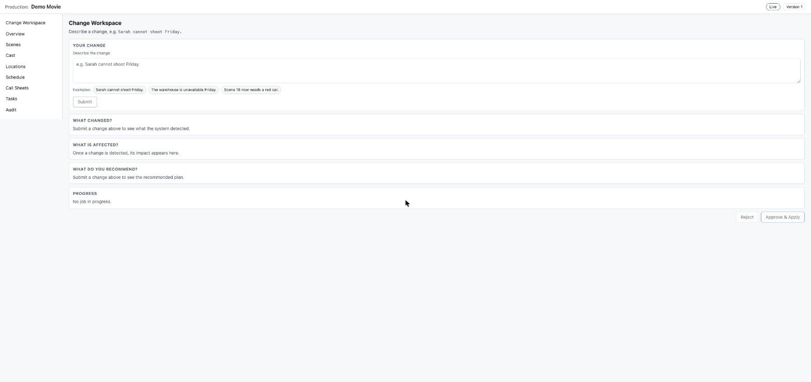
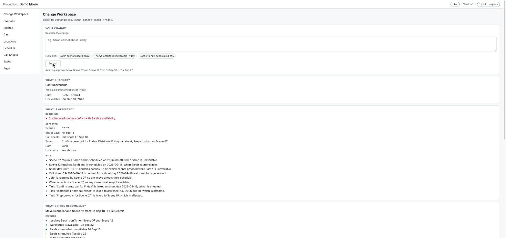
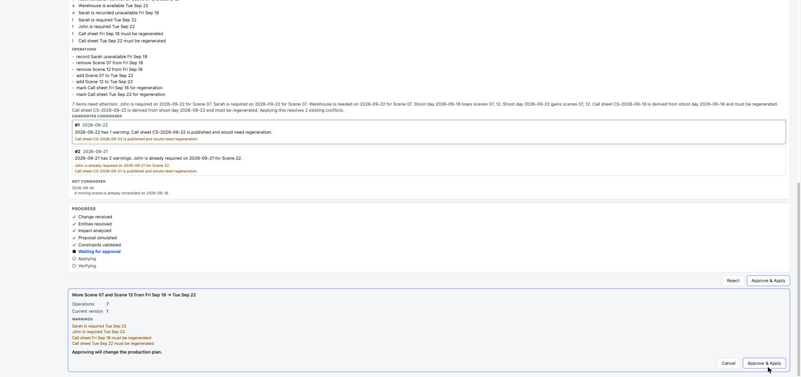
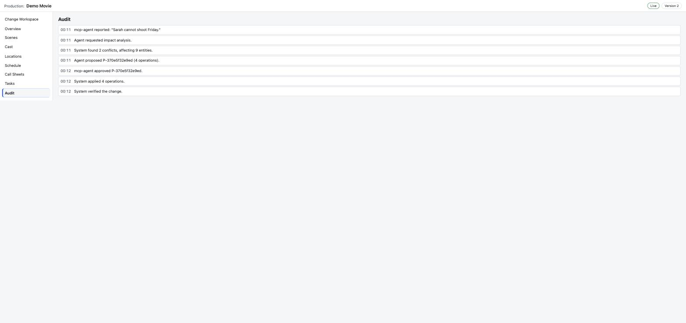
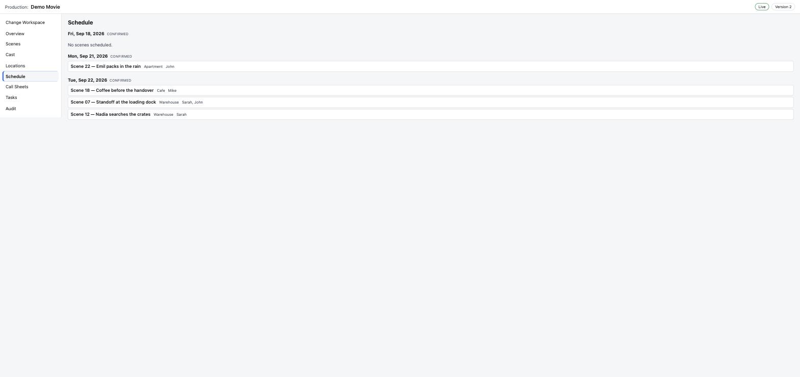

# AI Production Change Agent

[](https://github.com/Trapa-Eureka/product_agent/actions/workflows/ci.yml)

**MCP-powered production workflow assistant**

An independent portfolio project inspired by connected film/video production workflows. The system analyzes how a change to cast, locations, scenes, or schedules affects the rest of a production, proposes safe alternatives, and applies only human-approved changes through explicit MCP tools.

> This is not a StudioBinder product and does not use StudioBinder proprietary code, data, UI, or assets.

## Screenshots

Captured from a live run of the Demo Movie fixture (GOLDEN-1, `Sarah cannot
shoot Friday.`) — see `docs/DEMO_SCRIPT.md` for the full walkthrough.

| | |
|---|---|
|  Change workspace: input, impact, and proposal panels |  Impact panel (what's affected, why) and the proposed plan |
|  Final confirmation before a consequential write |  Full audit trail: reported → analyzed → proposed → approved → applied → verified |

Schedule after approval, confirming the write actually happened (Scene 07/12 moved off Friday):



## Product thesis

Production data is connected:

```text
Script / Scene
   ├─ Cast
   ├─ Location
   ├─ Props / Requirements
   ↓
Schedule
   ↓
Call Sheet
   ↓
Tasks
```

A change to one node can propagate across the workflow. The useful AI behavior is therefore not merely chat. It is **dependency-aware change analysis + safe action**.

## Core workflow

```text
User change request
        ↓
Interpret intent
        ↓
Read production state via MCP
        ↓
Deterministic dependency analysis
        ↓
Simulate candidate changes
        ↓
Validate constraints
        ↓
Explain impact and proposal
        ↓
Human approval
        ↓
Apply via MCP write tools
        ↓
Verify result + audit
```

## MVP scenarios

1. **Cast unavailable**
   - “Sarah cannot shoot Friday.”
   - Find affected scenes, schedule entries, call sheets, and tasks.
   - Propose valid alternatives.

2. **Location unavailable**
   - “The warehouse is unavailable Friday.”
   - Find all scenes scheduled there and downstream effects.
   - Propose rescheduling or replacement-location options.

3. **Scene requirement changed**
   - “Scene 18 now needs a red car.”
   - Update the proposed breakdown, identify prop/task implications, and flag schedule/call-sheet effects.

## Target stack

| Layer | Technology |
|---|---|
| Frontend | Angular + TypeScript |
| API | Node.js + Express + TypeScript |
| Database | MongoDB |
| AI | Provider adapter; AWS Bedrock target |
| Search/RAG | OpenSearch, optional for MVP |
| Async jobs | AWS SQS |
| Realtime | WebSocket |
| Agent tools | MCP |
| Infrastructure | Terraform |
| CI/CD | GitLab CI |
| Tests | Unit, integration, MCP contract, E2E |
| Local cloud dependencies | Deterministic mocks/adapters |

The stack intentionally exercises technologies relevant to the target engineering role. Local development must not require live AWS credentials.

**Free-first defaults.** This is a self-funded solo project, so paid services are never required to run it. MongoDB, Bedrock, and SQS are implemented as adapters for the portfolio, but the runtime defaults are a JSON file store, a rule-based interpreter (Ollama if installed), and an in-process queue. The whole product ships as one public npm package runnable with `npx`. See `ARCHITECTURE.md` §2 "Free-first constraint".

## Engineering principles

- Human decides consequential changes.
- LLM interprets intent and explains proposals.
- Deterministic code calculates dependencies and validates invariants.
- MCP is the controlled capability boundary.
- No direct LLM-to-database writes.
- Every mutation is auditable.
- Tests and local mocks are created early.
- Agent context is explicit and pruned when stale.

## Local development

Requires Node.js 22 or newer and pnpm. No AWS account, no MongoDB server, no
API key. The one local, one-time extra: `pnpm exec playwright install
chromium`, for the E2E suite (not run by `pnpm install` itself).

```bash
pnpm install
pnpm exec playwright install chromium
pnpm run verify
```

| Command | Purpose |
|---|---|
| `pnpm run typecheck` | TypeScript strict mode across the workspace |
| `pnpm run lint` | ESLint, including the framework-independence boundary rule |
| `pnpm run format` / `format:check` | Prettier for code (markdown is excluded) |
| `pnpm run test` | Unit suite |
| `pnpm run test:integration` | Integration suite (`*.integration.test.ts`) |
| `pnpm run test:contract` | MCP contract suite (`*.contract.test.ts`) |
| `pnpm run test:web` | Angular specs (`apps/web/src/**/*.spec.ts`), via `ng test` |
| `pnpm run test:e2e` | Playwright suite: three golden scenarios against a real browser (`e2e/`) |
| `pnpm run verify` | Local completion gate: runs the whole pipeline in order |
| `pnpm run seed` | Restores the Demo Movie fixture into the file store, clearing any stale proposals/audit trail from a previous run |

`verify` prints a per-step pass/fail summary and stops at the first failure with the command to re-run.

### Run the API

```bash
PCA_STORAGE=memory PCA_API_PORT=3000 pnpm exec tsx apps/api/src/main.ts
# REST under http://127.0.0.1:3000/api, WebSocket on ws://127.0.0.1:3000/ws
```

### Run the UI

```bash
pnpm --filter @pca/web start
# Angular dev server on http://localhost:4200, proxying /api and /ws to the API above
```

### Runtime environment

| Variable | Default | Meaning |
|---|---|---|
| `PCA_STORAGE` | `file` | `file`, `memory`, or `mongo` |
| `PCA_DATA_FILE` | `~/.production-change-agent/data.json` | JSON store location |
| `PCA_MONGO_URI` | `mongodb://127.0.0.1:27017/?replicaSet=rs0` | Mongo connection; must be a replica set |
| `PCA_MONGO_DB` | `production_change_agent` | Mongo database name |
| `PCA_MODEL` | `rules` | `rules` (free, no network), `ollama` (later), or `bedrock` (deferred, paid) |
| `PCA_QUEUE` | `memory` | `memory` (in-process, free) or `sqs` (deferred, paid) |
| `PCA_ALLOWED_PRODUCTIONS` | `*` | Comma-separated production IDs the MCP server may act on |
| `PCA_ACTOR_ID` | `mcp-agent` | Identity recorded for agent actions |
| `PCA_API_PORT` | `3000` | REST API and WebSocket port |
| `PCA_API_HOST` | `127.0.0.1` | Interface the API binds to |

## Architecture

```text
Angular Web App → Express API → { Change Analysis Domain, Repositories, Job/Queue port, Agent Orchestrator }
                                                                                  │
                                                              Model port ◄────────┤
                                                                                  └── MCP Client → MCP Server → allow-listed tools → Application services
```

The MCP server and the REST API are two delivery adapters over the same
application use cases — an MCP write tool cannot reach a capability the REST
API lacks, or the reverse. Every port (storage, model, queue) has a free
default (JSON file store, rule-based interpreter, in-process queue) and a
paid/deferred option (MongoDB, Bedrock/Ollama, SQS) documented but never
required. See `ARCHITECTURE.md` §4 for the full diagram (with every adapter
named) and §8 for the deterministic change-analysis pipeline; `docs/DEMO_SCRIPT.md`
walks the same architecture through an actual approved change.

## Trade-offs

- **Deterministic engine, narrow AI surface.** The model only interprets a
  sentence, ranks candidates the engine already validated, and writes prose —
  it never computes a dependency, a constraint, or a mutation
  (`ARCHITECTURE.md` §7–8). This makes the product's correctness testable
  without mocking a model for the invariants that matter, at the cost of a
  less "magical" demo than an agent that free-writes JSON.
- **Free-first defaults over the target stack.** MongoDB/Bedrock/SQS/Terraform
  are implemented, adapter-tested, and documented as the target stack for the
  role this is a portfolio for, but the default and only *executed* path is a
  JSON file store, a rule-based model, and an in-process queue
  (`ARCHITECTURE.md` §2). The trade-off is an MVP that cannot demonstrate live
  Bedrock latency or a real SQS retry, in exchange for `npx`-on-a-clean-machine
  reproducibility with zero account setup and zero recurring cost.
- **GitHub Actions executes; GitLab CI is documentation-only.** The repository
  is hosted on GitHub, so `.github/workflows/ci.yml` is the real, watched
  pipeline; `.gitlab-ci.yml` exists to show the same stages a GitLab-hosted
  version would run (`docs/WORK_PLAN.md`), but nothing in this repo ever
  executes it.
- **File store over an embedded database.** `PCA_STORAGE=file` writes one
  JSON document per production rather than adding a dependency like SQLite —
  simpler to inspect and reset (`pnpm run seed`), at the cost of no
  concurrent-writer safety beyond the app's own version check, which is fine
  for a single-operator demo and not a production multi-tenant deployment.

## Limitations

- No authentication/authorization beyond a single `X-Actor-Id` header and a
  server-side production allow-list; a real deployment puts an auth layer in
  front (`ARCHITECTURE.md` §15).
- The rule-based model interprets a fixed set of change phrasings well
  (the three MVP scenarios and close variants); it is not a general
  natural-language understanding system, and an unrecognized sentence is
  refused rather than guessed at.
- The candidate generator is intentionally simple (§8): it finds another
  valid day, not an optimized schedule across many constraints. A
  constraint-solving generator is future work, not attempted here.
- No multi-user concurrent-editing UX (two operators changing the same
  production at once see a version conflict, not a merge).
- OpenSearch/RAG-based document search is out of scope for the MVP (`README.md`
  "Non-goals").
- The file store keeps everything in one process's local disk; it is not
  meant to run multiple API instances against the same data directory.

## Documentation

Read in this order:

1. `CLAUDE.md`
2. `SPEC.md`
3. `DOMAIN.md`
4. `DESIGN.md`
5. `ARCHITECTURE.md`
6. `MCP.md`
7. `TESTING.md`
8. `TASKS.md`
9. `WORKFLOW.md`
10. `docs/DEMO_SCRIPT.md` — a timed, talking-point walkthrough of the golden scenarios

## Non-goals

- Rebuilding a complete production-management platform
- Copying StudioBinder UX or proprietary behavior
- Autonomous high-impact production decisions without approval
- Direct database access by an LLM
- Making an LLM the source of truth for deterministic scheduling/dependency rules
- Billing, enterprise administration, or full screenplay editing
- Storyboard/image generation in the initial MVP

## Definition of success

A clean checkout can run locally with deterministic fixtures and mock external services. The three MVP scenarios work end-to-end. The agent can read, analyze, simulate, and propose changes; mutations require explicit approval; MCP contracts and domain invariants are tested; and the repository contains enough context and automated feedback for coding agents to complete bounded tasks with minimal human interaction.
